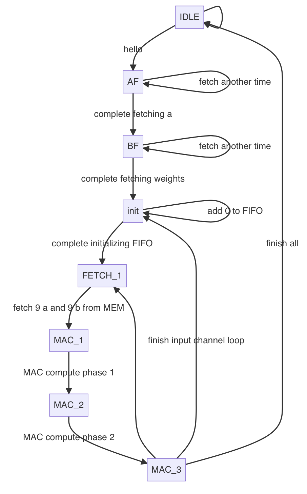
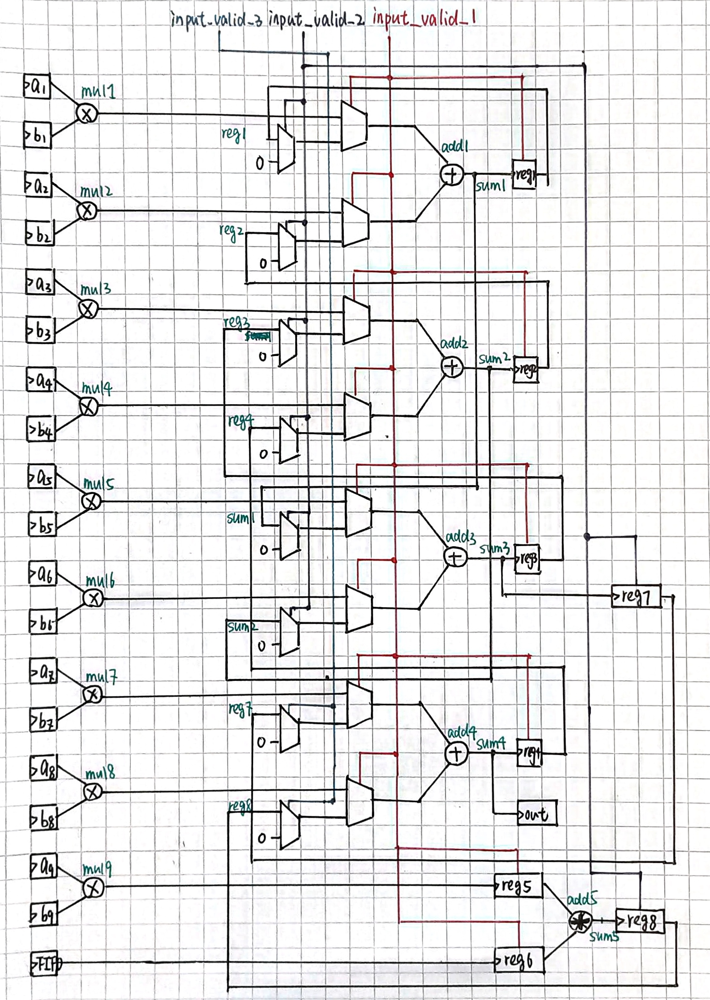

# Summary

## Performance

|          | Area   | Latency $(L)$ | Energy $(E)$ | $L\cdot E$         |
| -------- | ------ | ------------- | ------------ | ------------------ |
| Baseline | 13345  | 28311552      | 253756103    | $7.18\cdot10^{15}$ |
| Ours     | 379227 | 4524495       | 12871263     | $5.82\cdot10^{13}$ |

## Total Coverage Summary

| Score | Line  | Condition | Toggle | FSM   | Branch |
| ----- | ----- | --------- | ------ | ----- | ------ |
| 79.88 | 94.39 | 80.28     | 88.64  | 43.75 | 91.33  |

# Design Choices

## Unroll the MAC

- We changed the original MAC structure to a loop-unrolled version such that the clock cycle for computation can be reduced while giving more opportunity for parallel computation. The DFG of MAC is provided in Figure 2, while the FSM is provided in Figure 1.
  - Reasoning: Compared to the original version of MAC, we want to 1) reduce the load/store operations and storages of intermediate results and 2) increase the throughput of MAC. As a result, we decided to combine the operations over one convolution calculation into one single MAC. Thus, no registers/memory for intermediate results (in one single convolution) are required and the modified MAC can handle 18 16-bit input. 
  - Instead of storing/loading intermediate results to/from external memory, we store it into an on-chip FIFO (16-bit width, 16-bit depth). The intermidiate results, which is used for accumulating output channel because output channel is in the inner loop of input channel, are produced by each 9-MAC operations (in our design, that is one-time usage of MAC) and are used for constructing each channel of output feature map. The FIFO should be initialized to zero when the output channel index is 31 `AND` the input channel index is 3, which is done during the `init` state. 
  - For reducing latency, we changed the MAC structure from 2-stage into 3-stage, while preserving the 2ns clock peroid. This decrease the overall latency because most of the work done in one clock cycle is data fetching, which do not need a long critical path. 

## Use On-Chip Memory

- Instead of loading the image and weights in an order defined by the MAC computation, we first load image and weights onto on-chip memory, and then distribute the necessary data for each computation in an ordered way. This can reduce the operations to fetch data from test bench (external memory). 

  - Reasoning: because 

    - the energy consumption of loading data from external memory is 10 times expensive than loading data from on-chip memory, 
    - the area constraint is sufficient for us to develop on-chip memory, and 
    - many data is reused during convolution calculation, but in the original scheme, these reused data are reloaded frequently, leading to unnecessary energy consumption

    so we decided to firstly load data on chip, then distribute data using the previous knowledge on the convolution specifications. 

  - For on-chip memory which stores the image (`a`), we use a memory whose dimension is $16\cdot16384$ . For on-chip memory which stores the weight (`b`), we use a memory whose dimension is $16\cdot2048$. They all have one 16-bit input and 9 16-bit outputs. 
  
  - Before computation, image and weights are loaded with the indication of `a_ready` and `b_ready` respectively. Then, after initialization of the FIFO, two sets of 9 16-bit data is fetched and computed by MAC.

## Modifications on Testbench

- For driver, we modified the scheme of sending data from the original convolution-based order to an order absed on image structure. The interface is activated when detected `a_ready==1` or `b_ready==1`. Thus, the data transfer between external memory and chip is reduced, resulting in a drastic decrease over energy consumption. 
- For evaluating latency, we use the overall simulation time instead of the data transfer time indicated in the baseline. The time for storing the image and weights is 35,074 nano seconds, which contribute to 0.66% of the overall computation time. 

\pagebreak

# Appendix

{width=400px}

{width=550px}

